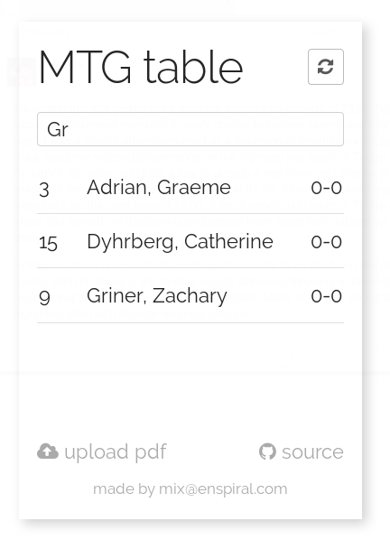

# mtg-tourney-app

Made to make that "pairings for round 2" crush a little less brutal.

Event organisers upload PDFs exported from Wizards Event Reporter.
Players load the app on their phone to easily see which table they've been posted to.




## Deploying to Heroku

### Easy One Click
Just click here: [](https://heroku.com/deploy)

### Command Line (For Seasoned Pros)

Install the heroku CLI, and clone down this repo.
In the root of this project, run:

```bash
heruku apps:create NAME_OF_YOUR_HEROKU_APP
heroku buildpacks:set https://github.com/heroku/heroku-buildpack-multi.git -a NAME_OF_YOUR_HEROKU_APP
git remote add heroku https://git.heroku.com/NAME_OF_YOUR_HEROKU_APP.git
git push heroku master
heroku open -a NAME_OF_YOUR_HEROKU_APP
```
